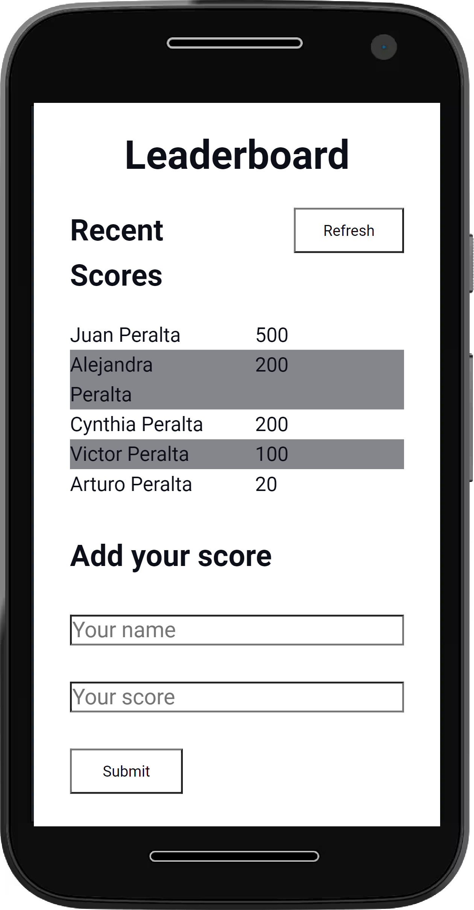
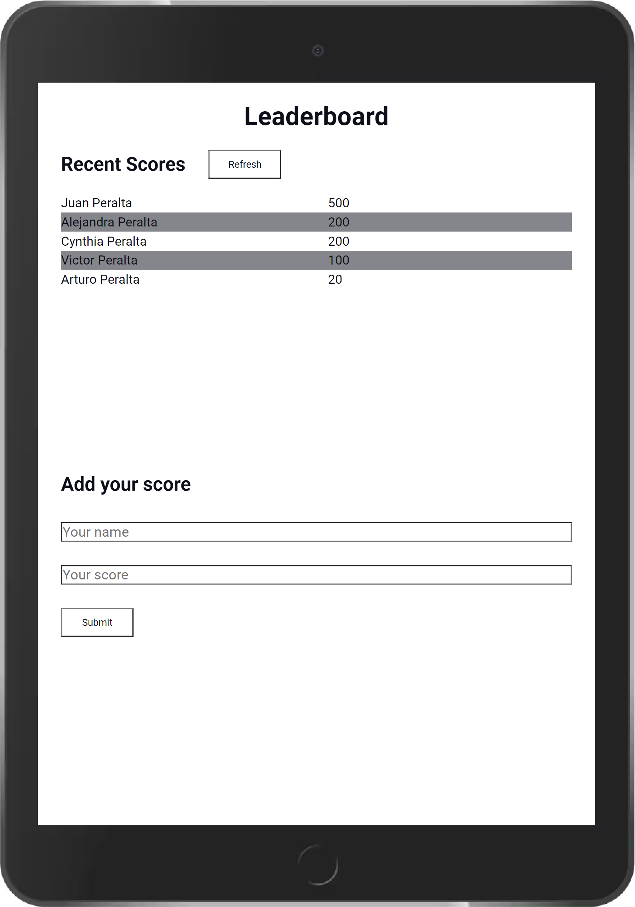
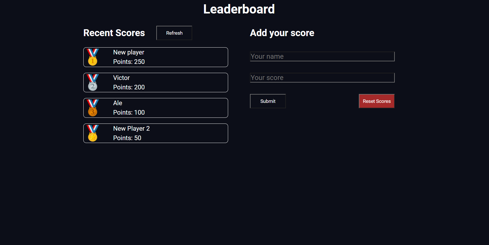

# Leaderboard
> A Leaderboard to keep track of your personal records or family's game

## Built With

- HTML
- CSS
- Javascript

## Live Demo
[Live demo](https://vicperalta.github.io/leaderboard/)

## Mobile

## Tablet

## Desktop

## Getting Started

To get a local copy follow these simple example steps.  

1.- Clone the repository using this command:  
`git clone git@github.com:VicPeralta/leaderboard.git` 

2.- To see the code open the project in your code editor of your preference.

## Author

👤 **Victor Peralta**
- GitHub: [@VicPeralta](https://github.com/VicPeralta)

## 🤝 Contributing

Contributions, issues, and feature requests are welcome!

Feel free to check the [issues page](https://github.com/VicPeralta/to-Do-List/issues).

## Show your support

Give a ⭐️ if you like this project!

## Acknowledgments

- A special thank for @fernandorpm for this amazing [README template](https://github.com/microverseinc/readme-template)

## 📝 License

This project is [MIT](./LICENSE.md) licensed.

