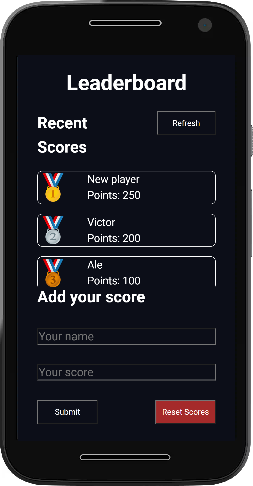
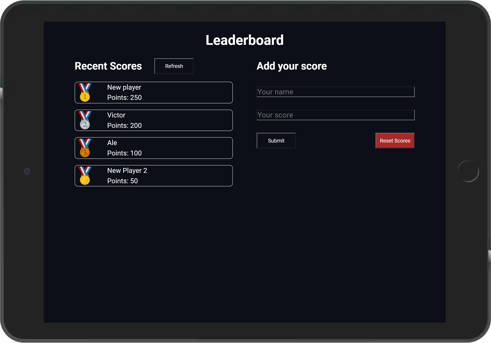

# Leaderboard
> A Leaderboard to keep track of your personal records or family's game scores

## Built With

- HTML
- CSS
- Javascript

## Live Demo
[Live demo](https://vicperalta.github.io/leaderboard/)

## Mobile

## Tablet

## Desktop

## Getting Started

To get a local copy follow these simple example steps.  

1.- Open the terminal window and clone the repository using this command:  
`git clone git@github.com:VicPeralta/leaderboard.git` 

2.- Change the directory to the leaderboard directory  
`cd leaderboard`  
3.- Install the project's dependencies by running this command:   
`npm install`  
4.- Generate the dist folder using this command:  
`npm run build`  
5.- Open the file `.\dist\index.html` to see the Web Page  
6.- To see the code open the project in the code editor of your preference.  
7.- To learn about the Leaderscore API, please check this [documentation](https://www.notion.so/microverse/Leaderboard-API-service-24c0c3c116974ac49488d4eb0267ade3).

## Author

👤 **Victor Peralta**
- GitHub: [@VicPeralta](https://github.com/VicPeralta)

## 🤝 Contributing

Contributions, issues, and feature requests are welcome!

Feel free to check the [issues page](https://github.com/VicPeralta/to-Do-List/issues).

## Show your support

Give a ⭐️ if you like this project!

## Acknowledgments

- A special thank for @fernandorpm for this amazing [README template](https://github.com/microverseinc/readme-template)

## 📝 License

This project is [MIT](./LICENSE.md) licensed.

